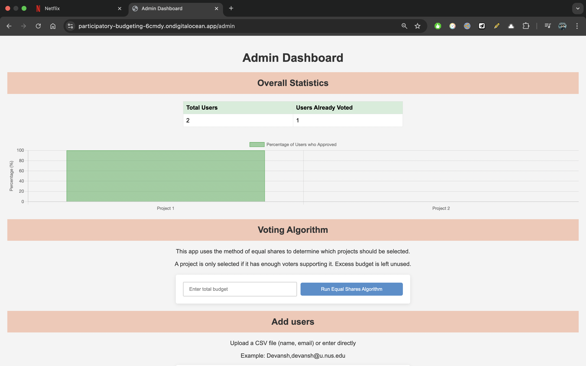
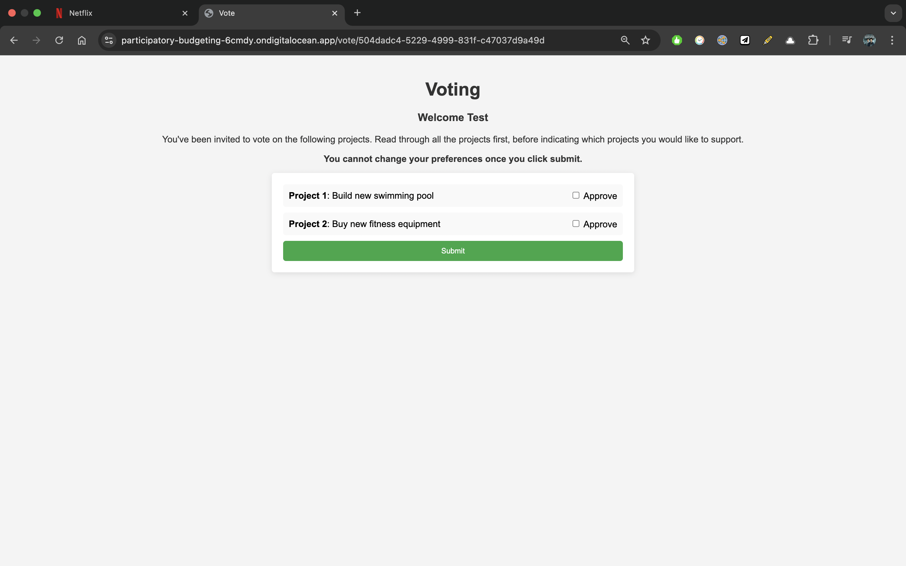

# Context

This participatory budgeting platform is a prototype built for the town council of Singapore, in collaboration with Prof. Warut Suksompong. This is to encourage public participation in local decision-making and resource allocation, which empowers citizens and promotes collective responsibility.

As the name suggests, it allows voters to submit their preferences for projects the government should work on, and then runs an algorithm to find the most appropriate set of projects for the government to do.

Tech Stack: Flask, Supabase, Digital Ocean.

**Flow (from Admin's perspective):**

1. Admins (i.e., the government) can add potential projects that they are considering to work on. (These themselves can be obtained through an open "call for projects").
2. Admins then add voters, who will receive a magic link via email.
3. While the voters are voting, the admin can visualize the votes for each project in a real-time dashboard.
4. After all the voters have voted, the admin can run an algorithm that will determine the optimal set of projcets to work on, following the voters' preferences.

**Flow (from the Voter's side):**

1. A voter receives a magic link in their email.
2. Using this magic link, they can sign-in to the platform and view the projects created by the Admin.
3. They look through the projects and select the ones they approve of.
4. Finally, they submit their preferences.
5. Once preferences are submitted, they cannot be changed.

**Algorithm:** At the heart of this platform is the algorithm that runs to decide which projects to work on, given that each project has some cost, there is a total budget that cannot be exceeded, and different voters have different preferences for which projects they'l like to see completed. Fortunately, there exists an algorithm for this usecase - the method of equal shares - which is what we implement.

**Potential improvements:**

- support rank-choice voting in addition to approval voting
- support alternative resource allocation algorithms in addition to MES

---

Upd (May 2025): After months of unresponsiveness from the town council's side, we decided to shut this project down.
